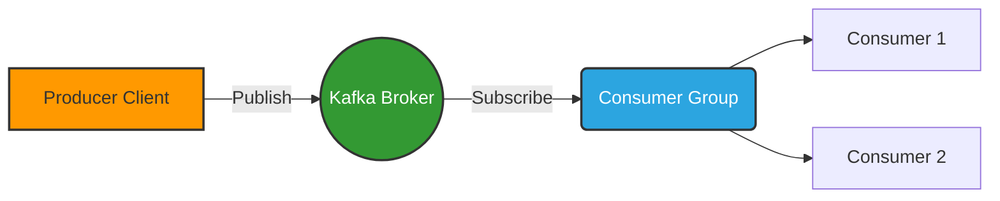

<div align="center">
  
  <h1>🚀 Node.js + KafkaJS Data Pipeline</h1>
  <p><i>A sleek, modern, and high-performance event streaming application.</i></p>

  <p>
    
    
    
  </p>
</div>

---

## 🌌 Overview

Welcome to the **Node.js + Kafka Data Pipeline**. This project demonstrates the core concepts of distributed event streaming. Under the hood, it utilizes `kafkajs` to handle massive amounts of real-time data seamlessly.

### ✨ Key Features
- **Admin Configuration**: Automated topic creation and partition management.
- **Producer Integration**: High-throughput message routing with specific key and partition targets.
- **Consumer Groups**: Efficient load-balancing with parallel consumer groups that process streams collaboratively.

---

## 🏗️ Architecture



---

## ⚡ Getting Started

### 1. Prerequisites
- **Node.js** (v18+ recommended)
- **Docker** & **Docker Compose** (to run Kafka locally)

### 2. Infrastructure Setup
Start the Kafka broker and Zookeeper instances using the provided Docker Compose configuration.

```bash
docker compose up -d
```
Wait a few seconds for the broker to initialize.

### 3. Install Dependencies
Install the required packages, including `kafkajs`.

```bash
npm install
```

---

## 🎮 Execution Flow

To see the system in action, follow these steps in separate terminal windows.

### Step 1: Initialize Topics
First, run the admin script. This connects to Kafka, provisions entirely new topics, and splits them into distinct partitions.
```bash
node admin.js
```

### Step 2: Start the Consumers
Launch one or more consumer scripts. You can specify a custom group ID to see how consumers divide the workload.
```bash
# Start Consumer 1 in a terminal
node consumer.js user-1

# Start Consumer 2 in another terminal with the same group ID
node consumer.js user-1
```
*(Pro tip: Connect multiple consumers with the same ID to watch Kafka magically auto-balance the topic partitions between them!)*

### Step 3: Produce Messages
Finally, unleash data into the pipeline using the producer script.
```bash
node producer.js
```
*Watch your terminal as the consumers instantly react and process the newly arrived messages.*

---

## 📂 File Structure

| File | Purpose |
| ---- | ------- |
| 🔌 `client.js` | Defines the configuration and bootstrap brokers. |
| ⚙️ `admin.js` | Provisions topics (`rider-updates`) and configures partitions. |
| 📤 `producer.js` | Responsible for efficiently dispatching messages directly into the streaming platform. |
| 📥 `consumer.js` | Listens to the event stream constantly and processes incoming payloads. |

<br/>

<div align="center">
  <sub>Built with ❤️ and KafkaJS</sub>
</div>
